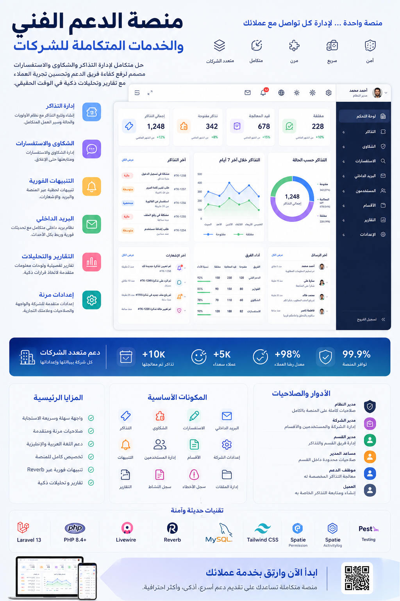

# Enterprise Support Desk SaaS | منصة مكتب الدعم الفني للمؤسسات



**Enterprise Support Desk** is a Laravel 13 multi-tenant SaaS support platform foundation for companies, customers, departments, tickets, complaints, inquiries, realtime notifications, internal mailbox, SLA tracking, reports, secure files, roles, permissions, branding, and localization.

**منصة مكتب الدعم الفني للمؤسسات** هي أساس لمنصة دعم فني بنظام تعدد المستأجرين (SaaS) مبنية باستخدام Laravel 13، تخدم الشركات، العملاء، الأقسام، التذاكر، الشكاوى، الاستفسارات، الإشعارات في الوقت الفعلي، صندوق البريد الداخلي، تتبع اتفاقية مستوى الخدمة (SLA)، التقارير، الملفات الآمنة، الأدوار، الصلاحيات، العلامات التجارية، والترجمة.

---

## 1. التقنيات المستخدمة | Tech Stack
`PHP` • `Laravel` • `Livewire` • `Tailwind CSS` • `Blade` • `Flux UI` • `Reverb` • `Spatie` • `Pest`

---

## 2. الإعداد | Setup

```bash
composer install
npm install
cp .env.example .env
php artisan key:generate
php artisan migrate --seed
npm run build
```

للتطوير المحلي (Local development):

```bash
composer run dev
```

يقوم هذا الأمر بتشغيل خادم Laravel، ومستمع الطوابير (queue listener)، وخادم Vite للتطوير.

## 1.3. البيئة (Environment)

أهم المفاتيح (Important keys):

- `APP_NAME`: الافتراضي `Enterprise Support Desk`.
- `APP_URL`: يجب أن يتطابق مع الرابط المحلي أو رابط الإنتاج.
- `APP_LOCALE`: اللغة الافتراضية للتطبيق، عادةً `en`.
- `APP_FALLBACK_LOCALE`: اللغة البديلة، عادةً `en`.
- `DB_CONNECTION`, `DB_DATABASE`, `DB_USERNAME`, `DB_PASSWORD`: إعدادات قاعدة البيانات.
- `QUEUE_CONNECTION=database`: يوصى به لعمل الأساس المحلي.
- `BROADCAST_CONNECTION=reverb`: مطلوب لميزات الوقت الفعلي (realtime).
- `FILESYSTEM_DISK=local`: تخزين المرفقات بشكل خاص افتراضياً.

## 1.4. Laravel Reverb

يستخدم هذا المشروع Laravel Reverb للإشعارات الخاصة في الوقت الفعلي وتحديثات صندوق البريد.

الافتراضيات المحلية الحالية:

```env
BROADCAST_CONNECTION=reverb
REVERB_HOST=localhost
REVERB_PORT=8081
REVERB_SERVER_PORT=8081
REVERB_SCHEME=http
VITE_REVERB_ENABLED=true
VITE_REVERB_PORT="${REVERB_PORT}"
```

ابدأ Reverb عند اختبار الميزات في الوقت الفعلي:

```bash
php artisan reverb:start
```

إذا لم يكن Reverb يعمل محلياً، قم بتعيين هذا الخيار لإيقاف أخطاء WebSocket في المتصفح:

```env
VITE_REVERB_ENABLED=false
```

ثم أعد بناء الملفات الثابتة (assets):

```bash
npm run build
```

## المصادقة (Authentication)

يتم التعامل مع المصادقة بواسطة Laravel Fortify مع شاشات Blade و Livewire.

القواعد:

- التسجيل العام ينشئ مستخدمين من نوع `customer` (عميل) فقط.
- يتم إنشاء أو دعوة المستخدمين الموظفين بواسطة مشرفين (admins) معتمدين.
- تخزن تفضيلات المستخدم اختيارات اللغة والمظهر (theme).
- يتم إدارة الملف الشخصي، كلمة المرور، الصورة الرمزية، والتفضيلات من إعدادات الحساب.

## الترجمة واللغات (Localization)

يدعم التطبيق اللغتين العربية والإنجليزية.

- ترجمات اللغة العربية موجودة في `lang/ar.json`.
- مفاتيح الترجمة الإنجليزية موجودة في `lang/en.json`.
- يخزن المستخدمون المسجلون تفضيلاتهم في `users.locale`.
- يخزن الزوار (Guests) لغتهم المحددة في الجلسة (session).
- يغير التخطيط (layout) إلى `dir="rtl"` للغة العربية و `dir="ltr"` للغة الإنجليزية.
- يتضمن شريط التنقل وشاشات المصادقة مبدّل لغات.
- تحمي الاختبارات ضد مفاتيح الترجمة العربية المفقودة للسلاسل النصية المرئية في واجهة المستخدم، الـ enums، وتسميات الصلاحيات.

## الأدوار (Roles)

الأدوار الأساسية في النظام:

- `super_admin` (مدير متميز)
- `company_admin` (مدير شركة)
- `department_manager` (مدير قسم)
- `department_deputy` (نائب قسم)
- `support_agent` (وكيل دعم)
- `customer` (عميل)

قم بتشغيل أداة إضافة الأدوار والصلاحيات (seeder):

```bash
php artisan db:seed --class=RolesAndPermissionsSeeder
```

## الصلاحيات (Permissions)

الصلاحيات دقيقة وتعتمد على الوحدات (module-based).

أمثلة:

- `companies.view`
- `users.invite`
- `tickets.view.own`
- `tickets.view.department`
- `tickets.assign`
- `complaints.reply`
- `inquiries.create`
- `notifications.mark_read`
- `mailbox.read`
- `files.download`
- `activity_logs.view`
- `error_logs.view`

تقوم واجهة المستخدم الخاصة بالأدوار بتجميع الصلاحيات حسب الوحدة (module) وتترجم التسميات للمستخدمين العرب.

## هيكل البناء (Architecture)

تتبع قاعدة الشفرة قواعد وكيل المشروع:

- البيانات المملوكة للمستأجر تستخدم `company_id`.
- أجهزة التحكم (Controllers) تظل بسيطة وخفيفة (thin).
- تتعامل مكونات Livewire مع تفاعل واجهة المستخدم فقط.
- منطق الأعمال (Business logic) يوجد في `app/Services`.
- الوصول للبيانات يوجد في `app/Repositories` و `app/Repositories/Contracts`.
- التخويل (Authorization) يوجد في `app/Policies`.
- الحالات والثوابت المتكررة توجد في `app/Enums`.
- الأحداث والمستمعون (Events and listeners) يتعاملون مع الإشعارات، تحديثات صندوق البريد، سجلات النشاط، والآثار الجانبية.
- الوظائف (Jobs) والأوامر المجدولة (scheduled commands) تتعامل مع المعالجة الثقيلة.

## الوحدات الرئيسية (Main Modules)

تشمل الوحدات الأساسية المنفذة ما يلي:

- شركات SaaS، الخطط، والاشتراكات
- المستخدمين، الملفات الشخصية، الأدوار، الصلاحيات، والدعوات
- الأقسام
- إعدادات الشركة، العلامات التجارية، المظهر (theme)، وتفضيلات اللغة
- التذاكر، الردود، التعليقات الداخلية، المرفقات، سجل التعيين، سجل الحالات، والتقييمات
- الشكاوى
- الاستفسارات
- الإشعارات
- صندوق البريد الداخلي
- أحداث Reverb في الوقت الفعلي
- سياسات اتفاقية مستوى الخدمة (SLA)، السجلات، التصعيد، وفحوصات الانتهاك
- سجلات الأنشطة (Activity logs)
- سجلات الأخطاء الآمنة
- لوحة تحكم التقارير
- الردود الجاهزة (Canned responses)
- قاعدة المعرفة والأسئلة الشائعة (Knowledge base and FAQ)
- الحقول المخصصة (Custom fields)
- سياسات رفع الملفات ومدير الملفات الآمن
- بوابة العملاء (Customer portal)

## الطوابير والمجدول (Queues And Scheduler)

لتشغيل معالج الطوابير (queue worker):

```bash
php artisan queue:work
```

لتشغيل المجدول (scheduler) يدوياً:

```bash
php artisan schedule:run
```

في بيئة الإنتاج، قم بتهيئة المجدول ليعمل كل دقيقة.

## التخزين (Storage)

يتم تخزين المرفقات بشكل خاص وتقديمها من خلال مسارات التنزيل المصرح بها.

قم بإنشاء رابط التخزين العام لأصول العلامة التجارية:

```bash
php artisan storage:link
```

تتم إدارة حدود التحميل للشركة من خلال سياسات رفع الملفات.

## الاختبار (Testing)

قم بتشغيل حزمة الاختبارات بالكامل:

```bash
php artisan test --compact
```

قم بتشغيل اختبارات الترجمة:

```bash
php artisan test --compact tests/Feature/LocalizationPreferenceTest.php
```

قم بتشغيل التنسيق:

```bash
vendor/bin/pint --dirty --format agent
```

قم ببناء أصول الواجهة الأمامية (frontend assets):

```bash
npm run build
```

## أوامر مفيدة (Useful Commands)

```bash
php artisan optimize:clear
php artisan view:clear
php artisan route:list --except-vendor
php artisan test --compact
vendor/bin/pint --dirty --format agent
npm run build
```

## القيود المعروفة (Known Limitations)

- لا تزال بعض شاشات الإدارة عبارة عن شاشات إدارة على المستوى التأسيسي ويمكن توسيعها بمهام عمل أكثر ثراءً.
- يحتوي منطق ساعات العمل في SLA على أساس عملي ويمكن تحسينه لإنشاء قواعد تقويم أكثر تقدماً.
- صلاحيات تصدير التقارير وهيكل الاستعلام موجودة، ولكن يمكن توسيع مهام التصدير المخصصة.
- تتطلب واجهات العرض (widgets) في الوقت الفعلي تشغيل Reverb أو تعيين `VITE_REVERB_ENABLED=false` أثناء العمل المحلي.
